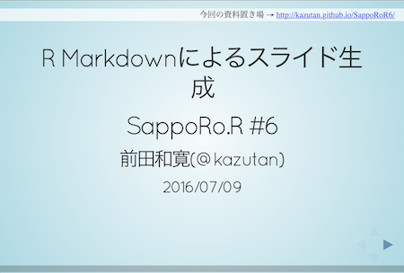

```{r setup, include=FALSE}
knitr::opts_chunk$set(echo = FALSE)
```

## ありがとうぞうさん

{width=50%}

SappoRo.R #6: R Markdownによるスライド生成（前田さん）

http://kazutan.github.io/SappoRoR6/rmd_slide.html

## その後

>- \Large revealjsをためてしてみた
    - \Large なかなかよかった

>- \Large beamer（単体）はつかったことがある

>- \Large 次はR Markdown+beamerでやってみよう

## なぜR Markdown

- \Large RStudioで完結
- \Large 作業を自動化
- \Large コピー&ペーストを撲滅

## 用意したもの

- \Large RStudio
- \Large TeXLive 2017 (MacTeX 2017)

## なやみどころのメモ

- LaTeXでの日本語フォントの設定
- この設定は何に対する設定?
    - knitr
    - pandoc
    - LaTeX
- Rから出力される図のサイズ
    - `fig.width`, `fig.height`, `out.width`, `out.height`
- Rから出力されるグラフィックの形式
    - `dev="pdf"`では日本語フォントが埋めこまれない
        - `dev="cairo_pdf"`ならOK
        - `dev="png"`で解像度をあげて(`dpi=200`)出力も


## yamlヘッダ
knitrの設定だが、`output:`はpandocへ渡される？
```
---
...
output:
  beamer_presentation:
    latex_engine: lualatex  # lualatexを使用
    keep_tex: true          # texソースをのこす
    includes:
      in_header: header.tex # header.texをよみこむ
---
```

## header.tex
LaTeXへの設定
```
\usepackage{fontspec}
%\setmainfont[Ligatures=TeX]{TeXGyreTermes}
\setmainfont[Ligatures=TeX]{TeXGyreHeros}
\setsansfont[Ligatures=TeX]{TeXGyreHeros}
%\setmonofont{Inconsolatazi4}
\setmonofont{NotoSansMonoCJKjp} % Notoフォント使用

%% Japanese font
\usepackage{luatexja-otf}
\usepackage[noto-otf,deluxe]{luatexja-preset} % Notoフォント使用
\setmainjfont{NotoSansCJKjp} % メインフォントもNotoSansに
\setsansjfont{NotoSansCJKjp}
```

## フォント

yamlヘッダ
```
#mainfont: NotoSansCJKjp
```

header.tex
```
%\setmainjfont{NotoSansCJKjp}
```

yamlヘッダよりLaTeXヘッダ優先


## 数式

LaTeXなので、数式は問題なし。

```
$$ \Pr(x \mid \mu, \sigma) =
\frac{1}{\sqrt{2\pi}\sigma}
\exp\left(-\frac{(x - \mu)^2}{2\sigma^2}\right) $$
```

$$ \Pr(x \mid \mu, \sigma) =
\frac{1}{\sqrt{2\pi}\sigma}
\exp\left(-\frac{(x - \mu)^2}{2\sigma^2}\right) $$

## Rでグラフ

Rなので、Rのグラフも
```{r, include=FALSE}
library(ggplot2)
```

しかし、デフォルトでは はみでる
```{r, echo=TRUE}
p <- ggplot(data = iris,
            mapping = aes(x = Sepal.Length, y = Sepal.Width,
                          colour = Species)) +
  geom_point()
print(p)
```

## チャンクでのオプション指定

ドキュメントをみる

- knitr > Chunk options and package options (Yihui Xieさん)
    - https://yihui.name/knitr/options/#plots

## サイズ調整
チャンクオプションで`fig.width=5, fig.height=3`を指定
```{r, fig.width=5, fig.height=3, echo=FALSE}
print(p)
```


## 日本語フォント
チャンクオプションで、 `dev="cairo_pdf"`を指定
```{r, fig.width=5, fig.height=2.5, dev="cairo_pdf", echo=TRUE}
p + labs(x = "萼の長さ", y = "萼の幅") +
  theme_grey(base_family = "IPAexGothic")
```

## まとめ
>- \Large CSSの知識があれば、reveal.jsの方が楽かも。
>- \Large でも、なんとかなる
>- \Large 先人の知恵を活用する
>- \Large いったん設定ができてしまえば、あとは楽？


